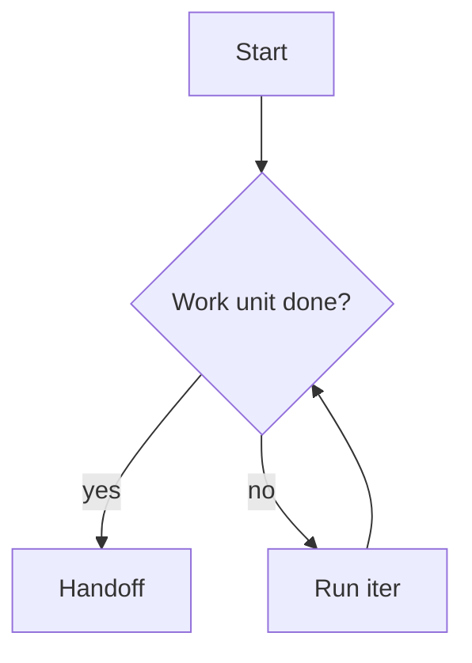

# Sample artifact

A document exercising every branch of the §9.4 render pipeline. Also
usable as the manual-verification fixture.

## Mermaid flowchart



## Code fences

```python
def handoff(state: dict[str, str]) -> str:
    return state["summary"].strip()
```

```typescript
export function compress(input: string): string {
  return input.replace(/\s+/g, ' ').trim()
}
```

```bash
set -euo pipefail
relay serve --bind 127.0.0.1:7800
```

```sql
SELECT seq, kind FROM events WHERE run_id = ? ORDER BY seq;
```

```json
{ "run_id": "abc", "status": "running" }
```

```yaml
relay:
  bind: 127.0.0.1:7800
```

```vue
<script setup lang="ts">
const x = 1
</script>
```

## Table

| Phase | Deliverable      |
|-------|------------------|
| 3     | REST API         |
| 4     | Dashboard MVP    |

## Task list

- [x] Scaffold
- [ ] File browser

## Footnote

The handoff is deliberately lossy.[^1]

[^1]: That compression is the entire value proposition.

## Raw HTML (must be escaped, not executed)


<script>window.__xss=1</script>
